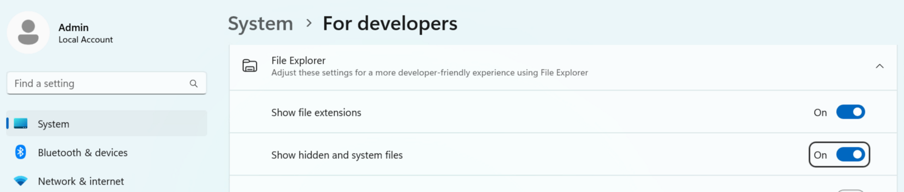

# Activity: Working locally with Git

**Objective**: By the end of this activity, you will be able to initialise a local Git repository, create and track files, understand the staging and commit process, and view the commit history - all from the command line.

## Instructions

### Step 0: Setup your Virtual Machine

- Connect to your VM (GoToMyPC or Learn on Demand)
- Enable: **Show hidden files in file explorer**

!!! quote ""
    

### Step 1: Setup

In your VM run the program: **Git Bash** ~ the icon should be the Desktop

You should now be at a prompt:

```sh
Admin@STUDENT MINGW64 ~ 
$
```

At this $ prompt copy and paste the following 2 lines:

```sh
git config --global user.email "you@example.com"
git config --global user.name "Your Name"
```

!!! note "Normally you would change the values to your email and name - but for this exercise it isn't nessessary"

### Step 2: Create directory

At the prompt type the command to make a directory called **my-git-project**:

```none
mkdir my-git-project
```

Change directory to this new directory:

```none
cd my-git-project
```

Show all the files including hidden files:

```none
ls -l
```

!!! note "You should see an empty list of files"
    - This confirms the directory is clean and ready for Git

### Step 3: Initialise Git

- To start using git run: `git init`
- Show all the files: `ls -l`
- Show all the files, including hidden files: `ls -al`

!!! note "You will now see a `.git` directory"
    - This is where Git stores all the internal data it needs to track your project
    - the dot `.` in fromt of the name automatically makes it a hidden file

### Step 4: Create a file

- Create your first file by running: `notepad hello.py`
- Enter the line: `print('Hello, World!')`
- Save and the file and close Notepad
- At the $ prompt - show all the files, including hidden files: `ls -al`

### Step 5: See the status

- To see the status run: `git status`

### Step 6: Add a file

- To add your file to the Git repository run: `git add hello.py`
- Now see the status: `git status`

### Step 7: Commit your file

- To commit your file run: `git commit -m "Created Hello World!"`
- The text after the `-m` flag is a commit message
- Now see the status: `git status`

!!! note "You should see a clean working directory message"
    - This is because everything is committed to the repository

### Step 8: View the Git logs

- To see the history of commits, run: `git log`

---

## Reflective / Discussion Questions

- What does `git init` actually do? Where is the evidence that Git is now tracking this folder?
- Why is it useful to check the status of your repository before and after each action?
- What is the difference between `git add` and `git commit`?
- How do hidden files like `.git` help Git work "behind the scenes"?
- Why do you think commit messages are important? What makes a good one?
- How might this process look different if you were working with others in a team?
