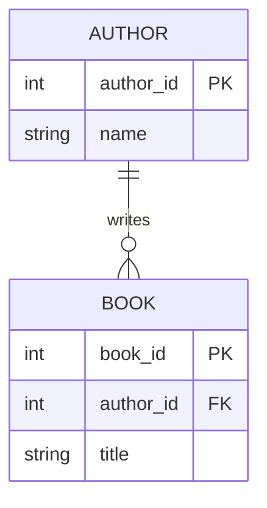

# Lab 2: Adding a repository in GitHub

!!! info "K6: Software development principles for data products, including debugging, version control, and testing."

**Objective**: By the end of this activity, you will be able to create a new repository on GitHub, configure basic settings such as the `README` and `.gitignore` file, and understand the purpose of these elements in version control.

## Instructions

### Step 1: Create a repository in GitHub

- Click your profile picture
- Click: Your repositories
- Click the green **New** button on the right hand side

### Step 2: Set the Repository settings

- Give your new repository a name

!!! info "Repository names"
    - Can't contain spaces or special characters
    - hyphens and underscores are okay
    - The name is **NOT** case sensitive

- Add a **description**
- Visibility: **Public**
- Start with a template: **No template**
- Add README: Turn this **On**
- Add .gitignore: Select **Python**
- Add license: **No license**

!!! info "Adding README and .gitignore"

    - README file: Helps explain what your project is about.
    - .gitignore: Tells Git which local files or folders to ignore
    - e.g., compiled Python files like `__pycache__/`

### Step 3: Finalise and Create

Click: **Create repository**

### Step 4: Create a few files in your new repository

- Add a file
- Add a new file in a new directory
- Add a file - then delete it
- Upload files into your repository
- Edit a file that you created previously
- Edit the `README.md` in the root directory

### Step 5: Working with branches

- Create a branch ~ select the `main` branch dropdown and enter a new name
- Switch to the new branch
- Add a file to the new branch
- Switch to the `main` branch - and see that file you just created isn't there

- Create another branch ... add some files ... then delete the branch

### Step 6: Share the repository with others

- Paste the URL to your repository into the chat
- Click on another persons link to see their repository

### Step 7: GitHub renders Mermaid diagrams

- Add a new file: `erd-demo.md`
- Paste in the following, including the `mermaid` code fence, and commit the file:

````text

````

- Open `erd-demo.md` on GitHub to see the rendered diagram

!!! info "Mermaid is just text. GitHub renders it into a diagram automatically wherever it appears in a `.md` file - no extra tools needed."

- You'll use this same syntax to build your own Entity-Relationship Diagram on Day 3

---

## Reflective / Discussion Questions

- Why do you think it’s useful to initialise a repository with a `README`?
- What types of files might you want to exclude using a `.gitignore` file?
- What are the advantages of keeping your repository public vs private?
- How might naming conventions (e.g. avoiding spaces) affect collaboration or automation?
- Can you think of a scenario where having a `.gitignore` is essential?
- How does creating the repo on GitHub first compare to creating it locally and pushing later?
