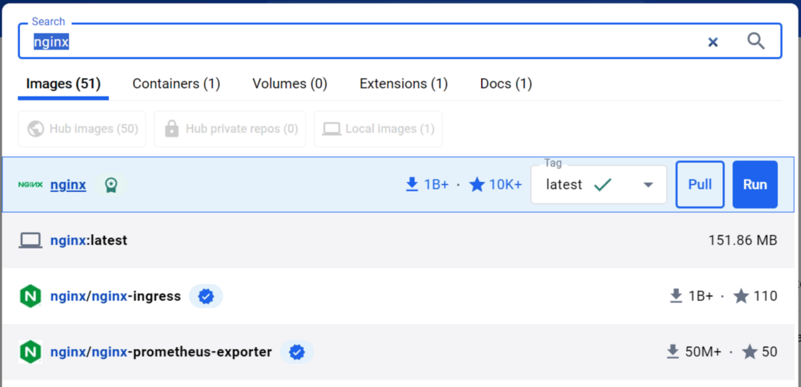
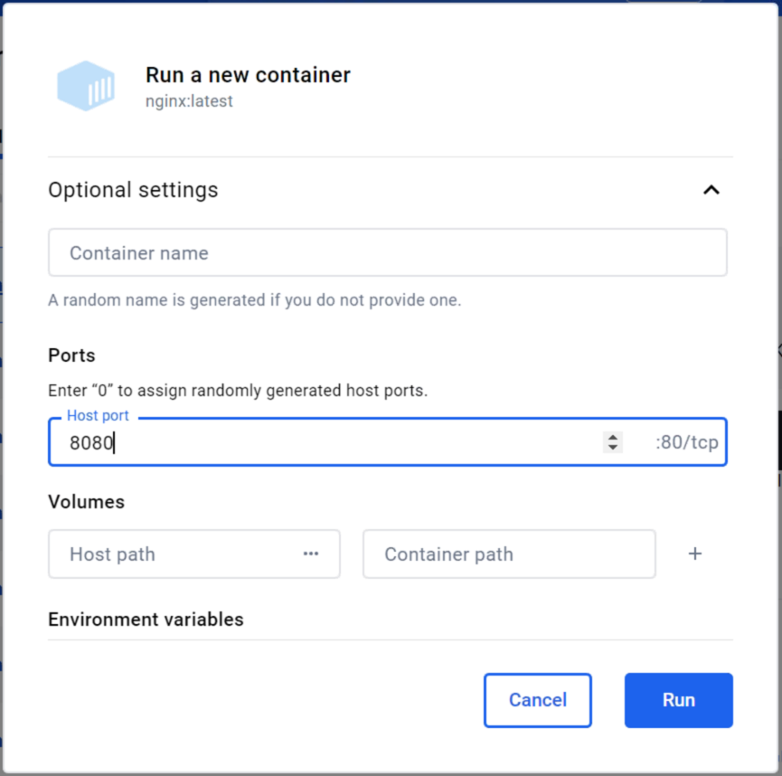
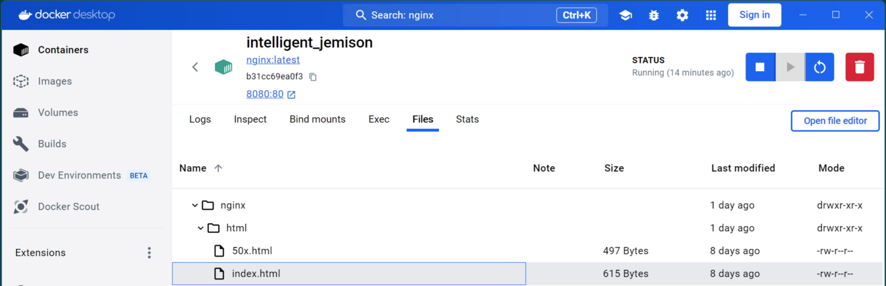
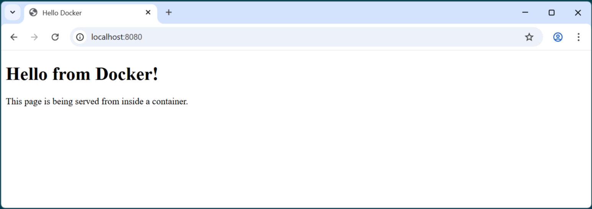

# Activity: Run an app in Docker without writing any code

**Learning outcome:**

- Learners understand the idea of images, containers, and port mapping by doing a quick hands-on task.

## Step 1: Concept first

- Docker pulls a packaged app (an image)

- Docker starts a running instance of that image (a container)

## Step 2: Learners explore Docker Desktop

- Open `Docker Desktop` in your Virtual Machine

- In the top search bar, search for: `nginx`

!!! quote ""
    

!!! info "`nginx` is a small web server image, very stable.")

- Click `nginx` ~ the Docker Official Image (it should be the forst option)

## Step 3: Pull the Docker image

- Click `Pull` on the selected `nginx` official Docker image

*This downloads the image to your Virtual machine*

## Step 4: Run the Docker image

- Click `Run` on the selected `nginx` official Docker image

*This runs the downloaded nginx Docker image*

- Click the down arrow to expand the **Optional settings**

- Change the `Host port` to `8080`

!!! quote ""
    

- Click `Run`

## Step 5: Open a browser to see `nginx` running as a webserver

- Open a browser

- Enter the URL: http://localhost:8080/

!!! quote ""
    

!!! sucess "You now have a WebServer runing in a container on your Virtual Machine!"

## Step 6: Add your own code to the `index.html` file

- Under Containers on the right menu, find `nginx` and click `Files`

- Navigate to: `/usr/share/nginx/html/` and find the `index.html` file

- Click the `index.html` file, and then click `Open file editor`

!!! quote ""
    

- Replace the curent code with this code:

```html
<!DOCTYPE html>
<html>
  <head>
    <title>Hello Docker</title>
  </head>
  <body>
    <h1>Hello from Docker!</h1>
    <p>This page is being served from inside a container.</p>
  </body>
</html>
```

- Click the :material-content-save: `Save changes` icon

**Refresh you browser page to see your changes**

!!! quote ""
    

---

## Cleanup

- Stop the container from running by clicking the `Stop` button

- You can also **delete the Container**

- And then you can delete the image to free up space
