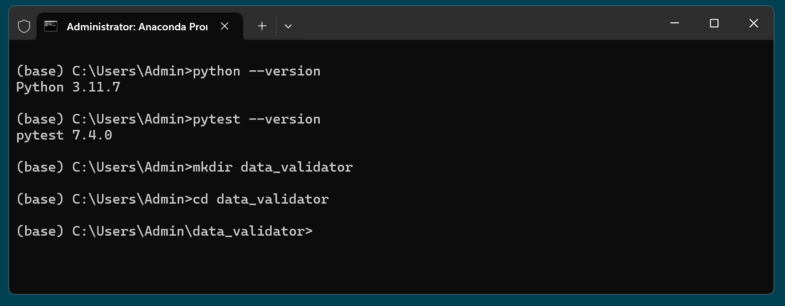
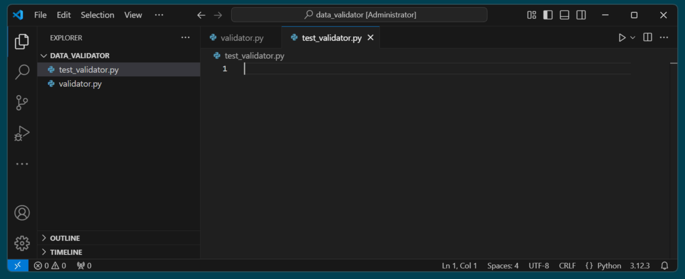

# Activity F1: Test Driven Development (TDD)

## TDD Exercise: Data Validation Function

### Anaconda prompt

In your VM in the Search bar type: **Anaconda Prompt**


Select the app to open a Windows command prompt window

### Setup

1. Confirm that Python version 3 is installed on the VM: `python --version`
2. Ensure pytest is installed on the VM: `pytest --version`
3. Create a simple project structure:
   - Create a folder called **data_validator**: `mkdir data_validator`
   - Change directory to the folder: `cd data_validator`



!!! note "Virtual Enviroment"
    - In a normal development situation you should use a Virtual Enviroment
    - For simplicity we will not do that!
    - But in all cases outside of this training enviroment it is an absolute requirement

### Open Visual Studio Code

1. To start Visual Studio Code run: `code .`
2. Switch to VS code and click Trust the authors if prompted
3. Close the Welcome screen
4. Create two empty files: `validator.py` and `test_validator.py`



### TDD principles

- "Write a failing test first, then implement the minimum code to pass the test, then refactor"
- Use **Arrange** ... **Act** ... **Assert** structure in your Python test function.

### Setup GitBash shell in VS Code (optional)

1. In VS code select: `View --> Terminal` or `Ctrl+'`
2. If you want a GitBash shell then click the + and select: `GitBash`
3. in the shell run pytest: `pytest`

---

## Instructions

### Step 1 - Write the first test in `test_validator.py`

```python
import pytest
from validator import validate_data_record

def test_empty_record():
    # Arrange
    record = {}
    
    # Act
    result = validate_data_record(record)
    
    # Assert
    assert result == False, "Empty records should be rejected"
```

## Step 2 - Run the test and see it fail (because the function doesn't exist yet)

- `pytest test_validator.py -v`

## Step 3 - Implement the minimum code in `validator.py` to pass the test:

```python
def validate_data_record(record):
    return False  # Simplest implementation to make the test pass
```

## Step 4 - Run the test and see it pass

- `pytest test_validator.py -v`

## Step 5 - Write a second test for a positive case:

```python
def test_validate_data_record_accepts_valid_record():
    # Arrange
    record = {
        "id": 1001,
        "timestamp": "2025-05-14T10:30:00",
        "value": 42.5,
        "status": "active"
    }
    
    # Act
    result = validate_data_record(record)
    
    # Assert
    assert result == True, "Valid records should be accepted"
```

### Step 6 - Run the test and see it fail

- `pytest test_validator.py -v`

### Step 7 - Update the implementation to pass both tests

```python
def validate_data_record(record):
    required_fields = ["id", "timestamp", "value", "status"]
    
    # Check if record is empty
    if not record:
        return False
        
    # Check if all required fields exist
    for field in required_fields:
        if field not in record:
            return False
            
    return True
```

### Step 8 - Run tests and see them pass

- `pytest test_validator.py -v`

### Step 9 - Add more test cases**

```python
def test_validate_data_record_rejects_missing_fields():
    # Arrange
    record = {
        "id": 1001,
        "value": 42.5,
        # Missing timestamp and status
    }
    
    # Act
    result = validate_data_record(record)
    
    # Assert
    assert result == False, "Records with missing fields should be rejected"
```

### Reflection and Discussion

- How does TDD help in planning a data product?
- In what data engineering scenarios would TDD be particularly valuable?
- How does this connect to the broader SDLC and quality assurance?
- What additional validations would be important in a real data pipeline? (data types, ranges, formats)

### Optional Extension

If you finish early, add validation for:

- Data types (e.g., id must be an integer)
- Value ranges (e.g., value must be positive)
- Timestamp format validation
