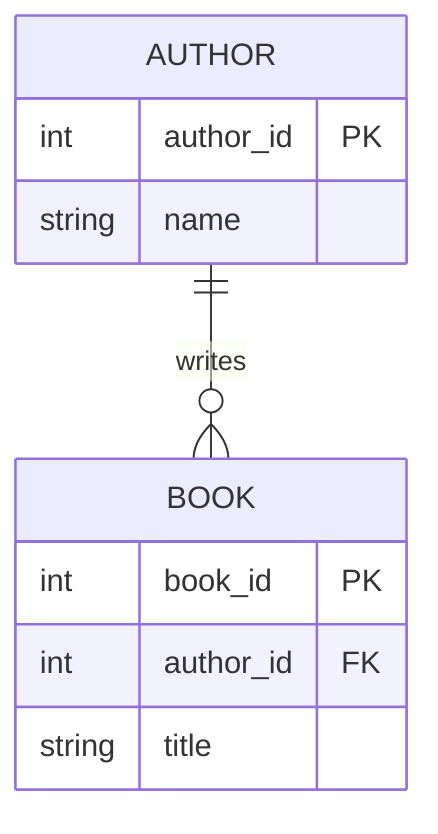

# Group Activity 2: Conceptual Data Model

Take the entities, relationships and access patterns from Activity 1 and **formalise them into a diagram**. Use the [Mermaid ERD syntax](mermaid-erd.md) from the demo.

### Instructions

Each group needs to create a **conceptual data model**:

- Draw an entity-relationship diagram using Mermaid (`erDiagram`) in your group's **HedgeDoc** page
- Show the key entities and the relationships between them
- Note the relationship cardinalities (one-to-one, one-to-many, many-to-many)
- Mark a single **primary identifier** for each entity
- Add **2 to 3 significant attributes** per entity - just enough to make the entity concrete. You will complete the full attribute list in Activity 3, so do not try to be exhaustive here.

**Starter:**

````text

````

---

### Report Back

- Present your Entity-Relationship Diagram (ERD) to the class
- Someone in your group shares their screen, and the group talks through some relevant entities and relationships

