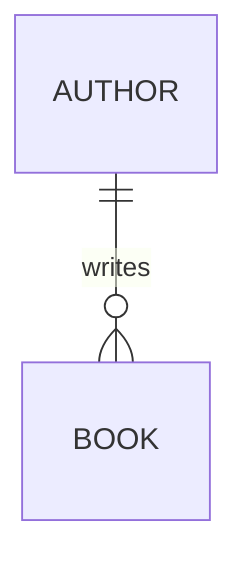
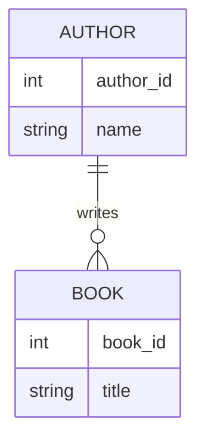
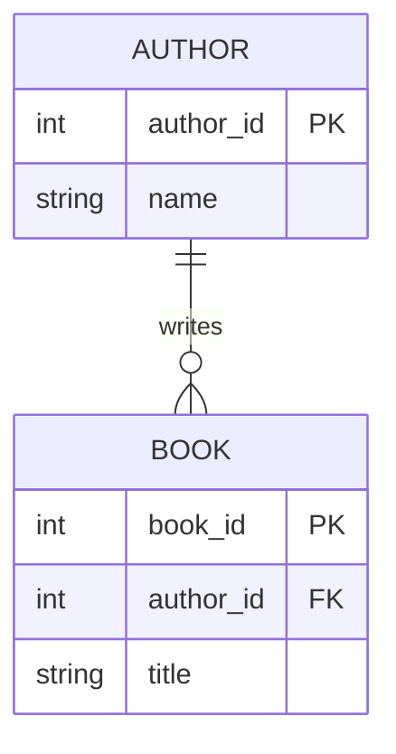
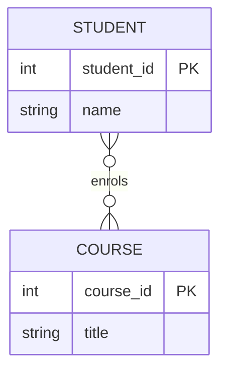

# Creating Entity-Relationship Diagrams with Mermaid

## 1. Mermaid turns text into a diagram

Show this:

```text
erDiagram
    AUTHOR ||--o{ BOOK : writes
```


!!! note "Mermaid is just text. The symbols either side of the line describe the relationship."

## 2. Cardinality symbols

The symbols each side of the line say how many of each thing are involved:

```text
|| = exactly one
o| = zero or one
}o = zero or many
}| = one or many
```

```text
AUTHOR ||--o{ BOOK : writes
```

Reads as: "one author writes zero or many books."

## 3. Entities need attributes

```text
erDiagram
    AUTHOR {
        int author_id
        string name
    }
    BOOK {
        int book_id
        string title
    }
    AUTHOR ||--o{ BOOK : writes
```


## 4. Primary and foreign keys

```text
erDiagram
    AUTHOR {
        int author_id PK
        string name
    }
    BOOK {
        int book_id PK
        int author_id FK
        string title
    }
    AUTHOR ||--o{ BOOK : writes
```


!!! note "PK marks an entity's own identifier. FK marks a column that points back to another entity's PK - this is what the relationship line is actually describing."

## 5. Add a many-to-many relationship

Not everything is one-to-many. A student can enrol on many courses, and a course has many students:

```text
erDiagram
    STUDENT {
        int student_id PK
        string name
    }
    COURSE {
        int course_id PK
        string title
    }
    STUDENT }o--o{ COURSE : enrols
```


!!! info "Mermaid renders natively in HedgeDoc and in GitHub **.md** files. Your group will build its ERD this way in Activity 2."
